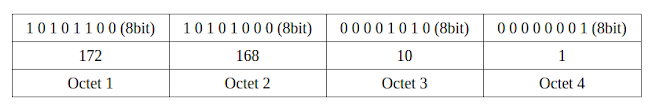

# Internet Protocal

## 인터넷 프로토콜 스위트
> 인터넷에서 컴퓨터들이 서로 정보를 주고받는 데 쓰이는 **통신규약(프로토콜)의 모음**

 

* 응용 계층

 

* 전송 계층

 

* 인터넷 계층

 

* 링크 계층

 

## VPN (가상 사설망 - Virtual Private Network)
> 집단 내에서 컴퓨터들을 잇는 사설 네트워크를 만들 때, 일일이 전선으로 연결하기에는 돈이 많이 들고 물리적으로 보안에 취약 (참고 - 인트라넷)
> 인터넷 네트워크와 암호화 기술을 이용하여 통신시스템을 구축하는 것을 의미 
> 사용자/장치가 직접 연결된 하나의 개인 네트워크에 있는 것처럼 데이터를 보내고 받을 수 있도록 확장된 개인 네트워크를 생성

* vpn 서버와 단말기 사이의 통신
  > vpn를 통해 네트워크를 확장한다고 생각 가능

 

  

## IP 주소

IP 주소 : 32비트 (4바이트)로 구성된 논리적인 주소체계
- '.(dot)'으로 구분된 Octet(8 bit / 1 byte) 4개가 조합되어 IP 주소를 나타냄
- IP주소는 2진수로 사용되지만 2진수로 표기하면(00000000.00000000.00000000.00000000) 사람이 이해하기 어렵기 때문에 10진수로 나타내는 표기법을 사용한다.
  

- IP는 각 옥텟별로 0 ~ 255 까지의 범위를 가지개 되며 부여할 수 있는 IP 개수는 256개가 된다.
  -> 전체 IP 수는 약 42억개로 한정되어있다. (4,294,967,296 개)

  

## subnetmask
- 넷마스크를 이용해 네트워크를 나누는 것을 서브넷팅(Subnetting)이라 함.
- 서브넷 마스크의 형태는 IP 주소와 똑같이 32bit의 2진수로 되어있다.
- 표현법 : Bitmask (Bits) / Dotted Decimal  
  -> 비트 개수를 생각하면 됨.

  ex) /0 == 0.0.0.0  
      /26 == 255.255.255.192

   

#### [참고]  
  *-* 인터넷 프로토콜 - https://ko.wikipedia.org/wiki/%EC%9D%B8%ED%84%B0%EB%84%B7_%ED%94%84%EB%A1%9C%ED%86%A0%EC%BD%9C_%EC%8A%A4%EC%9C%84%ED%8A%B8  
  *-* VPN이란? 나무위키 - https://namu.wiki/w/%EA%B0%80%EC%83%81%20%EC%82%AC%EC%84%A4%EB%A7%9D?from=VPN  
  *-* vpn 개념과 원리 - https://www.alibabacloud.com/ko/knowledge/what-is-vpn  
  *-* IP 주소 체계와 클래스 구별법 - http://korean-daeddo.blogspot.com/2015/12/ip.html  
  *-* 서브넷마스크 개념 및 적용방법 - http://korean-daeddo.blogspot.com/2016/01/blog-post_26.html#contents02  
