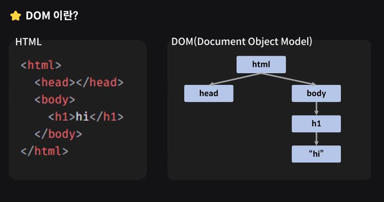
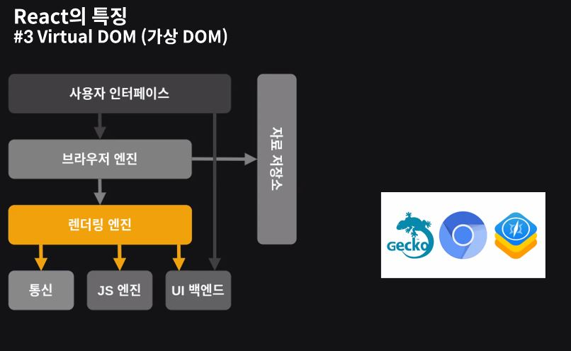
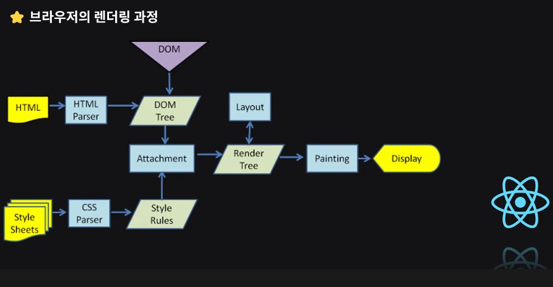
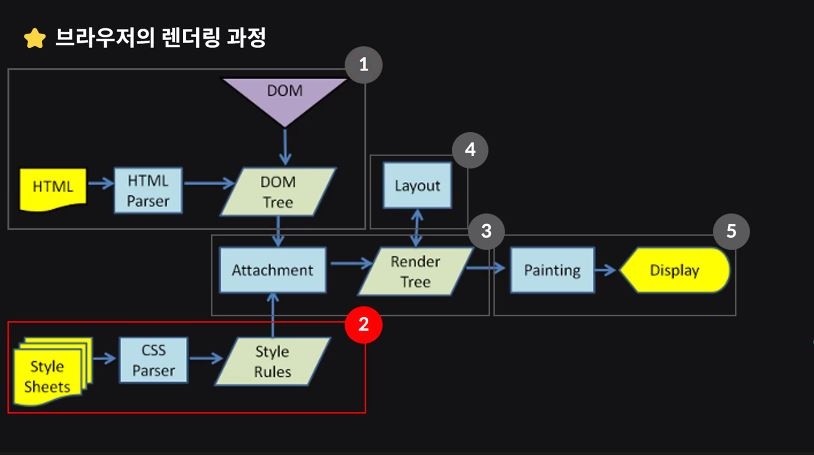

# React

재사용이 가능 = 모듈화가 가능

Facebook이 Javascript를 기반으로 만든 오픈소스

React를 만든 이유

급격한 성장으로 인한 문제점
1. 코드의 복잡도 증가에 따라 유지보수가 어려워짐
2. 예상치 못한 버그 발생
3. 최적화 문제로 인한 성능 저하 (ex. 메모리 누수)

Fax.js -> React

React의 특징
0. SPA
* SPA
  단일 페이지를 유지하는데 특화된 프레임워크
  하나의 페이지를 가지고 필요한 프로그램만 바꿔 끼우는 구조 - 변경되는 요소만 변경

  페이지 이동(변경)이 빠름.
  페이지 이동시 깜빡이지 않고 빠르며 쾌적한 

  Client Side Rendering

* MPA(Multi Page Application)
  여러페이지

  새로운 페이지로 이동할 때 reload

  Server Side Rendering

웹사이트
- 정보 전달 목적

웹어플리케이션
- 사용자 상호작용이 목적

> 브라우저 위에서 프로그램을 사용하는 것과 같은 느낌.

1. 선언형 프로그래밍

* 선언형 프로그래밍
간결하게 목적만 명시하는 프로그래밍 방법

* 명령형 프로그래밍
목적을 이루기 위한 모든 과정을 명시하는 프로그래밍 방법

상호작용하는 DOM update 이벤트 핸들러를 사용하면 복잡함 - 클린코드를 작성하기 어려움

2. 컴포넌트 기반

* 컴포넌트 - 독립적으로 존재할 수 있는 UI 구성요소 
  (Header, Main, Aside, Footer)
  jsx 함수를 활용하여 element를 반환하는 형태의 함수를 사용

  컴포넌트단위로 분할하여 구조를 구성하면 가독성이 좋음.

  중복코드 작성문제 - 산탄총 수술(Shotgun surgery)

3. Virtual DOM (가상 DOM)

* DOM - HTML의 계층 구조를 Tree로 나타내어 JS로 접근할 수 있게 해주는 역할

* Virtual DOM - (JS 객체로 나타냄) [?? 잘못 적은것 같음]

Rendering 과정 중 가장 많은 리소스를 차지하는 항목
Reflow - 레이아웃 변화
Repaint - CSS 변화 (레이아웃은 변화 없음)
Reflow가 일어나면 Repaint를 다시 해야함

JS를 이용하여 작업을 하면 Reflow와 Repaint가 일어나지 않도록 최적화에 유의하면서 작성해야한다.

React는 Virtual DOM을 활용하여 변화를 모아서 한번의 변경으로 DOM을 업데이트해준다. - 효율적인 DOM 조작

1. 높은 자유도

라이브러리 - 프로그램의 구성요소
프레임워크인 뷰와 앵글로

> 뷰의 경우 JS 문법보다는 Vue 문법을 사용
> React는 순수 JavaScript 기반의 메소드 사용

리액트의 멘탈모델이 프론트의 다른 라이브러리에서도 많이 사용됨

고려사항
* internet Explorer 를 지원하지 않음 (구식 JavaScript 엔진을 사용하기 때문)

* learning curve
  자유도가 높아 코딩 스타일을 맞추기 어렵다.

학습방법
1. JavaScript 선행
2. Node.js 선행 - JavaScript를 브라우저뿐만 아니라 다른 곳에서 작동할 수 있게하는 실행 프레임워크 (?)
3. 프로젝트 위주 학습 - 문제에 따라 해결하는 방식이 다름

client-side가 존재하는 이유는 server-side에 대한 종속성을 없애기 위함이라 생각할 수 있다.

애자일 - 짧은 싸이클을 돌리며 [작성 > 파악 > 리펙토링]을 진행
> 리펙토링을 진행하며 기능을 추가해나간다.

잘게잘게 쪼개서 프로세스 진행기간을 최대한 최소화. & 

