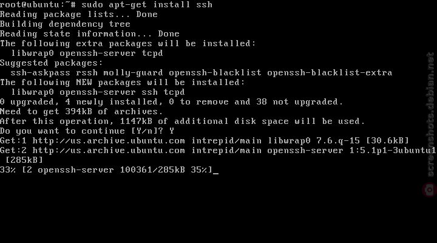

# Linux

<br>

## Linux Configuration (파일시스템)

LVM : dynamic partitions, meaning that you can create/resize/delete LVM "partitions" (they're called "Logical Volumes" in LVM-speak) from the command line while your Linux system is running: no need to reboot the system to make the kernel aware of the newly-created or resized partitions.

### 파일시스템과 파티션

* 파일시스템 : 파일을 저장하기위한 논리적인 구조
* 디스크 파티션 : 물리적인 디스크를 논리적인 저장영역으로 분할하는 것


<br><br>

### VMware의 네트워크 모드

VMware의 네트워크 모드는 세가지(NAT, Bridge, Host Only)가 있으며 주로 NAT 모드를 사용한다.


<br><br>

### VMware에 Linux 설치하기

VMDK 파일 생성방식
- Store virtual disk as a single file : 
- Split virtual disk into multiple files : 다른 컴퓨터로 옮길 때 더 편리함.


<br><br>

SSH vs OpenSSH

SSH(Secure SHell)는 컴퓨터간에 안전하게 데이터를 전달할 수 있도록 규정한 프로토콜이다.
OpenSSH는 SSH 프로토콜을 구현한 오픈소스이며 리눅스에서 SSH server & client로 주로 사용된다.
(참고: 인터페이스와 구현체 관계)


apt-get install ssh  |  **apt-get install openssh(-server)**  > 둘은 같은 명령어나 마찬가지이다. (서로 의존관계로 연관되어 있음.)


Ubuntu의 패키지 정보가 제공되는 웹사이트에서 ssh 팩키지와 Openssh 패키지의 다운로드 소스 팩키지는 'openssh'로 서로 같다.
[check]: 'Other Packages Related to ssh', Download Source Package openssh
(웹프로그래밍 관점에서 인터페이스 팩키지를 다운받음으로서 구현체인 OpenSSH를 받는다고 생각할 수 있음)

<br>



> 1. Install ssh
> 2. Read package lists
> 3. Build dependency tree
> 4. (after yes) install other packages like openssh-server, etc


<br><br><br>

systemctl status ssh로 프로세스 상태를 확인해보면 OpenBSD Secure Shell server가 실행중인 것을 확인할 수 있다.
> sudo systemctl status ssh


<br><br><br>

### 방화벽 설정 (firewall)

서버 통신의 in/out-bound 통신의 포트번호, IP 주소 등을 허용하기 위해서는 방화벽 정보를 설정해야한다.
리눅스에서는 iptables, ufw로 방화벽을 설정할 수 있다.
(iptables와 ufw는 유사한 기능을 가지고 있으며 사용법이 복잡한 iptables와 달리 ufw는 간편하게 사용할 수 있다.)


* ufw(Uncomplicated FireWall) : 복잡한 iptables에 비해 사용법이 간편하다. 간단하게 방화벽을 설정 할 수 있다.

* iptables : 사용법이 복잡하고 ufw에 비해 정교한 설정을 하기 위해 사용한다.


<br><br><br>


### 디스크 용량 관리


<br><br><br>
<br><br><br>

## 프로세스
--

### 시작 프로세스 - 서비스 등록 : init, systemd

init 프로세스

부팅이 시작되면 사용자 영역에서 최초로 시작되는 프로세스

* init.d : init 프로세스가 실행되기 위한 스크립트 파일들이 나뉘어서 보관된 곳
  (프로그램 하나를 설치하면 기동, 종료스크립트가 init.d 디렉토리에 설치되었음. **systemd로 대체**)

<br>


**Systemd**

* init 프로세스에서 개선된 프로세스
* pid1
* 시스템 전반에 영향을 끼침
* linux가 부팅되는 과정에서 시스템을 초기화하고 환경설정을 해주는 역할
* 시스템 부팅 동안의 과정들을 병렬화하여 동작

init, systemd 를 통해서 서비스 등록을 할 수 있다.
> sudo service tomcat9 start

c.f.) systemctl (서비스 제어 명령어)

service 명령어는 **systemctl**의 wrapper script다.


<br><br>

<br><br><br><br>

## 명령어


<br><br><br>

### 서비스 제어 명령어


<br><br>

ls

ls는 해당 디렉토리에 위치한 파일/디렉토리 정보를 제공하며 ll은 ls 명령어에 [-l] 옵션을 준 명령어를 의미
> ll = ls -l

_*_ ll은 sudo 키워드와 함께 사용할 수 없지만 ls -l은 sudo와 함께 사용할 수 있음

<br><br>

파일 / 디렉토리 갯수 확인하는 방법

```
ls -l | grep ^d | wc -l // 디렉토리 갯수

ls -l | grep ^- | wc -l // 파일 갯수

```


<br><br><br>

grep
> grep -- -search_keyword
> : 더블 대시를 사용하여 대시문자를 검색할 수 있다.


> grep 메타문자
^ : 라인의 시작


<br><br><br>

wc 명령어 (word count) : 사용자가 지정한 파일의 행, 단어, 문자수를 세는 프로그램

옵션 : -l (행), -w (단어), -c (문자)


<br>

### 다중 명령어

한 문장으로 단일 명령을 수행할 수 있지만 몇가지 명령어를 통해 여러 명령을 동시에 실행할 수 있다.

* ; [세미콜론] - 명령들을 구분하는데 사용하며 명령들간 영향을 받지 않는다. 실패 & 성공 조합 가능
* | [파이프] - 리눅스에서 파이프는 두 프로세스를 이어주는 역할을 함. '$ 명령A | 명령B' 는 '명령A'의 결과를 가지고 '명령B'를 수행한다는 의미 
* && [더블앤퍼센드] - 앞선 명령이 에러 없이 정상 종료되었을 때 뒷 명령이 실행 (세미콜론과의 차이)
* || [더블버티컬바] - 첫번째 명령의 결과가 에러가 발생했을 때 뒷 명령이 실행

<br><br>


## 권한 관리

리눅스는 멀티유저 시스템이기 때문에 파일/디렉토리에 접근할 수 있는 권한(**Permission**)이 존재

<br><br>

파일정보 보기 <br>
> $ ls -al  //현재 위치의 파일들을 자세히 보여주는 명령어

``` linux
drwxr-xr-x 3 root root 4096 2022-03-11 18:14 ./
drwxr-xr-x 3 root root 4096 2022-03-11 18:14 ../
drwxr-xr-x 3 root root 4096 2022-03-11 18:14 ROOT/
      ...
```

* 파일 Type : [d] - 디렉토리, [l] - 링크파일, [-] - 일반 파일, etc..
* **퍼미션 정보** : 해당파일에 어떤 퍼미션이 부여되어있는지 표시
* 링크수 : 해당 파일이 링크된 수 (윈도우의 바로가기와 동일)
* 소유자 : 해당 파일의 소유자 이름
* 소유그룹 : 해당 파일을 소유한 그룹 이름 (특별한 변경이 없으면 일반적으로 소유자가 속한 그룹이 소유그룹으로 지정되며 대부분 소유자 이름과 동일)
* 용량 : 파일 용량
* 생성날짜 : 파일 생성날짜
* 파일 이름


<br><br>

**권한(Permission, 퍼미션)**

<br>

권한(Permission) 종류  <br>
* 읽기(r) : 파일의 읽기 권한
* 쓰기(w)) : 파일의 쓰기 권한(생성, 수정, 삭제)
* 실행하기(x) : 파일의 실행 권한
<br> (디렉토리는 실행권한이 있어야 내부로 이동 가능)

<br>

사용자에 따른 권한 지정
* 소유자 : 소유자에 대한 권한 지정
* 그룹 : 소유 그룹에 대한 권한 지정
* 공개 : 다른 사용자에 대한 권한 지정

```
   eg.) d rwx r-x ---      소유자에게는 모든 권한이 존재, (rwx)
                           소유그룹에는 읽고 실행할 수 있는 권한 존재, (r-x)
                           다른 사용자는 아무 권한도 존재하지 않음. (---)

```


<br><br>

권한 변경하기

> chmod [변경될 권한값] [변경할 파일]

> 권한 값 구하는 방법
   * 각 권한 기호를 숫자로 변환 (r = 4, w = 2, x = 1 | 2진법 기반)
   예) r-x = 401 
   <br>

   * 변환한 숫자를 합산 예) 401 > 4+0+1 = 5
   
   이처럼 사용자에 따른 권한을 숫자값으로 변환하여 표기하며 디렉토리의 경우 [-R] 옵션을 주어 디렉토리의 모든 하위 파일 및 디렉토리의 권한을 변경할 수 있다. <br>

   if) 권한이 'rwxr-xr-x' 라면 4+2+1 | 4+0+1 | 4+0+1 = 755라는 권한 값을 의미


``` linux

   chmod 755 a.sh
   chmod -R 777 shell/

```


   


<br><br>

## 사용자 관리


## 그룹 관리


<br><br>

## 폴더 / 파일 관리


<br><br>

<br><br>


## 프로그램 설치

1. 소스파일 컴파일 설치 - 매우 불편. '2. 패키지 파일 설치방법' 고안됨

2. 패키지 파일 설치
   > $ dpkg

3. 자동 설치 도구 이용 - 수동으로 하던 패키지의 다운로드 ~ 설치 과정을 자동으로 처리
   > $ apt-get install [패키지 이름]    ||   apt-get install [패키지 이름]

APT - Advanced Packagaging Tool

## 파일(디렉토리) 이동 / 이름변경 / 복사

* mv : 파일을 다른 디렉토리로 이동하거나 다른 이름으로 바꾸고자할 때 사용
> $ mv [-옵션] '원본 디렉토리' '옮길 디렉토리' <br>


_*_ 경로가 동일하면 rename이 되고 다르면 경로가 다르면 파일이 이동 <br>
_*_ rename 명령어 존재

<br>

* cp : 파일 및 디렉토리를 복사
> $ cp [-옵션] '원본 디렉토리' '옮길 디렉토리'


<br><br>

## 파일 다운로드

wget : 비대화식 네트워크 다운로더 (Web GET)
> $ wget [-옵션] URL

tar : 파일의 압축 / 해제 명령어
> $ tar [-옵션] 파일이름

여러 개의 파일을 하나의 파일로 묶거나 풀 때 사용하며 테이프 아카이버(Tape ARchiver)의 앞글자들을 조합하여 tar라 명명


<br><br>
<br><br>

### [참고] <br>
  * 리눅스 설치
  *-* vmware 네트워크 모드 (NAT, Bridge, Host Only) - https://tristan91.tistory.com/238 <br>
  *-* VMwared Network setting (port forwarding - NAT) - https://hwan1001.tistory.com/63 <br>

  *-* VMware 리눅스 설치 - https://lindarex.github.io/ubuntu/ubuntu-1804-installation/ <br>
  *-* 'virtual disk as a single file' vs 'Split virtual disk into multiple files' - https://junyharang.tistory.com/8 <br>
  *-* What is LVM > dynamic partitions - https://github.com/johngrib/simple_vim_guide/blob/master/md/vimrc.md <br>

  *-* 파일시스템 & 디스크 파티셔닝 - https://ttps2line.tistory.com/33 <br>
  *-* 파일시스템 확인방법 - https://websetnet.net/ko/commands-to-check-filesystem-in-linux-ubuntu/ <br>

<br>

  * SSH
  *-* SSH and OpenSSH - https://www.quora.com/What-are-the-differences-between-SSH-and-OpenSSH-What-are-their-similarities <br>
  *-* Package: SSH [Official] - https://packages.ubuntu.com/bionic/ssh <br>
  *-* Package: OpenSSH [Official] - https://packages.ubuntu.com/bionic/openssh-server <br>
  
  *-* install tomcat in VMware - https://antdev.tistory.com/52 <br>

<br>

  *-* vi / vim 단축키 - https://iamfreeman.tistory.com/entry/vi-vim-%ED%8E%B8%EC%A7%91%EA%B8%B0-%EB%AA%85%EB%A0%B9%EC%96%B4-%EC%A0%95%EB%A6%AC-%EB%8B%A8%EC%B6%95%ED%82%A4-%EB%AA%A8%EC%9D%8C-%EB%AA%A9%EB%A1%9D <br>
  
  *-* 다중 명령어[@@@] - https://jhnyang.tistory.com/66 <br>

  *-* 시스템 (c.f. 서비스 등록) - https://etloveguitar.tistory.com/57 <br>

  *-* ll, ls-l - https://zetawiki.com/wiki/%EB%A6%AC%EB%88%85%EC%8A%A4_ll,_ls_-l <br>
  *-* 파일 정보 확인 (ls -al) - https://www.leafcats.com/137 <br>
  
  *-* 디렉토리에 있는 디렉토리 / 파일 갯수 확인 - https://blog.leocat.kr/notes/2017/07/27/shell-count-folders-and-files <br>

  *-* grep 명령어 메타문자 - https://zzsza.github.io/development/2017/12/16/linux-4/ <br>
  *-* grep 대시(-) 문자 검색방법 : 더블대시 [stackoverflow] - https://stackoverflow.com/questions/2427913/how-can-i-grep-for-a-string-that-begins-with-a-dash-hyphen <br>
  *-* wc(word count) command - http://www.incodom.kr/Linux/%EA%B8%B0%EB%B3%B8%EB%AA%85%EB%A0%B9%EC%96%B4/wc <br>
  
  <br><br>

  * 권한 관리

  *-* 파일 허가권 소유자 및 그룹 - https://darrengwon.tistory.com/853 <br>
  *-* 사용자 관리 - https://withcoding.com/101 <br>
  *-* 그룹 생성 및 권한 부여 - https://twowinsh87.github.io/etc/2018/08/12/etc-iknowledge-linux-group_permission/ <br>
  
  *-* 파일 이동, 이름변경 - https://shinboard.net/archives/4109 <br>
  
  *-* 권한 개념 및 변경 방법 - https://conory.com/blog/19194 <br>
  *-* 권한 및 소유권 변경방법 - https://withcoding.com/103 <br>
  *-* 소유자 및 그룹 관리방법 - https://www.manualfactory.net/13414 <br>

  <br>

  *-* 리눅스 프로그램(패키지) 설치 - https://conory.com/blog/42585 <br>
  *-* apt와 apt-get 차이점 - https://ksbgenius.github.io/linux/2021/01/13/apt-apt-get-difference.html <br>
  *-* 파일 다운로드(wget) - https://hippogrammer.tistory.com/158 <br>
  *-* tar 커맨드 개념 - https://recipes4dev.tistory.com/146 <br>


