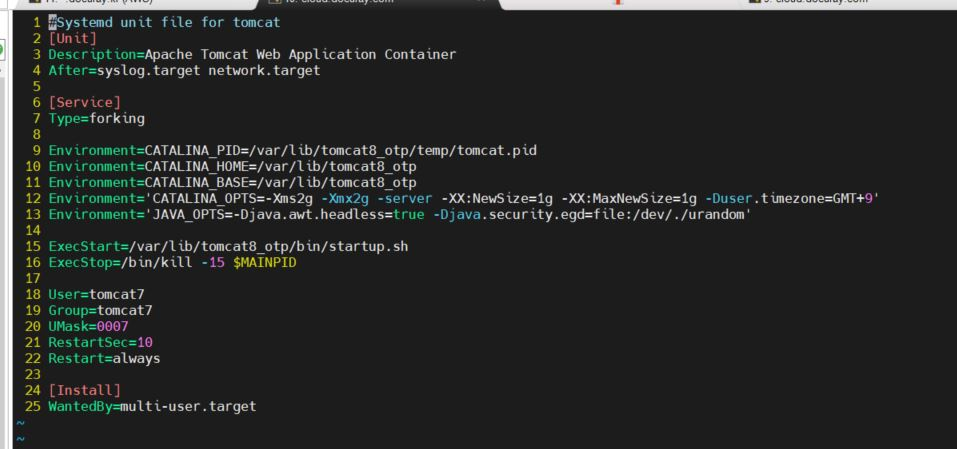

# Tomcat Command & Configuration

### 톰캣 설치 및 배포작업
1. tomcat 설치
2. tomcat 환경 설정
3. Service에 톰캣 등록 - application 관리 가능
4. Nginx 등록 및 SSL 설정
5. Tomcat log 설정 - rotatelog

 

**0. Tomcat 버전 및 관련 정보 확인**
> $ sudo bash /var/lib/tomcat8/bin/version.sh

 

 

Tomcat 환경정보 설정

톰켓이 사용할 메모리를 설정하기 위해 현재 사용 중인 메모리를 고려  

> $ cat /proc/meminfo  
> $ free -h

 

**1. Tomcat 설치**

다운로드
> $ wget https://dlcdn.apache.org/tomcat/tomcat-8/v8.5.76/bin/apache-tomcat-8.5.76.tar.gz   // wget [options] {URL}

파일묶음 해제 및 위치 이동
> $ tar -zxvf apache-tomcat-8.5.76.tar.gz         // tar [options] {fileName}  
> $ sudo mv ~/apache-tomcat-8.5.76/ ./tomcat8_otp           // mv [options] {from} {to}  -- 이름 지정 가능

원활한 파일 실행을 위한 사용자 권한 및 그룹 설정 (Owner / Group)
> $ sudo chown -R tomcat7.tomcat7 tomcat8_otp/*      // chown [options] User[:Group] file(or directory)  

-R 옵션을 추가하면 설정하려는 폴더와 그 폴더의 모든 하위 폴더의 소유자 정보 역시 변경된다.

_*_ 사용자 및 그룹을 변경하기 전 기존 사용자/그룹정보 확인
_*_ 명령어 chmod는 파일권한을 변경한다.

  

**2. Tomcat 환경 설정**

server.xml  
8080 port가 사용 중이라면 port 충돌을 막기 위해 port 변경 작업 수행
> sudo vi /var/lib/tomcat8_otp/conf/server.xml

_*_ DataBase 생성 및 사용자 추가
  * CREATE DATABASE {NAME};
  * CREATE USER 'userName'@'host'(접속 IP) identified by 'password';
  * GRANT ALL PRIVILEGES ON DB명.테이블명 TO userName@host [identified by password];    // 계정이 존재하는데 'identified by 비밀번호'를 사용하면 비밀번호 변경
    flush privileges;    // 변경된 내용을 메모리에 반영(권한 적용)

 

service에 톰캣 등록 - 톰캣 systemd 단위파일 생성

systemd에 등록할 서비스 이름으로 텍스트 에디터 편집
> $ sudo vi /etc/systemd/system/tomcat8_otp.service

_*_ 플로우에서 확인 후 {{CATALINA_HOME}} 자리에 톰캣 폴더경로 표기

  

**3. Nginx 등록 및 SSL 설정**
> sudo vi /etc/nginx/conf.d/tomcat.conf

_*_ nginx 디폴트 설정파일 - /etc/nginx/nginx.conf
_*_ rsync는 방화벽 문제 때문에 못받는 경우가 생길 수 있다.
_*_ 심볼릭 링크로 연결된 파일일 경우 rsync로 받으면 문제가 없으나 외부로 옮긴 후 해당파일을 받게되면 해당 링크가 깨진상태가 된다.

  

  
  

### [참고]  
  *-* how to check tomcat version in Linux - https://stackoverflow.com/questions/14925073/tomcat-how-to-find-out-running-tomcat-version  
  *-* Tomcat 설치 설정 실행 방법 - https://it-serial.tistory.com/entry/Linux-Apache-Tomcat-JSP-OracleDB-%EC%84%A4%EC%B9%98%EC%97%B0%EB%8F%99-%E2%91%A1  
  *-* 톰캣 설치 및 환경 설정 - https://it-serial.tistory.com/entry/Linux-Apache-Tomcat-JSP-OracleDB-%EC%84%A4%EC%B9%98%EC%97%B0%EB%8F%99-%E2%91%A1  
  *-* linux User/Group 설정 - https://codechacha.com/ko/linux-chown/  

  * mysql
  *-* database 

  *-* rsync 사용방법 - https://www.lesstif.com/system-admin/rsync-data-backup-12943658.html  
  *-* 심볼릭 링크 생성방법 - https://4urdev.tistory.com/49  

   

  *-* tomcat 로그설정 (rotatelog) - https://gangnam-americano.tistory.com/42
  

