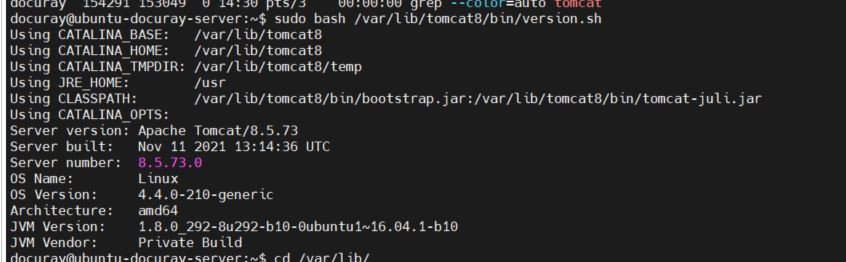
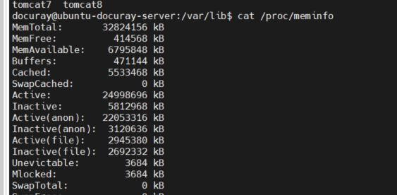

# Tomcat Command & Configuration

 

**Tomcat 버전 및 관련 정보 확인**
> $ sudo bash /var/lib/tomcat8/bin/version.sh

 

 

Tomcat 환경정보 설정

톰켓이 사용할 메모리를 설정하기 위해 현재 사용 중인 메모리를 고려  

> $ cat /proc/meminfo  
> $ free -h

 

### Check: 
1. tomcat 설치
2. tomcat 환경 설정
3. Service에 톰캣 등록 - application 관리 가능
4. SSL 

  
  

### [참고]  
  *-* how to check tomcat version in Linux - https://stackoverflow.com/questions/14925073/tomcat-how-to-find-out-running-tomcat-version  
  *-* Tomcat 설치 설정 실행 방법 - https://it-serial.tistory.com/entry/Linux-Apache-Tomcat-JSP-OracleDB-%EC%84%A4%EC%B9%98%EC%97%B0%EB%8F%99-%E2%91%A1  
  *-* 톰캣 설치 및 환경 설정 - https://it-serial.tistory.com/entry/Linux-Apache-Tomcat-JSP-OracleDB-%EC%84%A4%EC%B9%98%EC%97%B0%EB%8F%99-%E2%91%A1  
  

