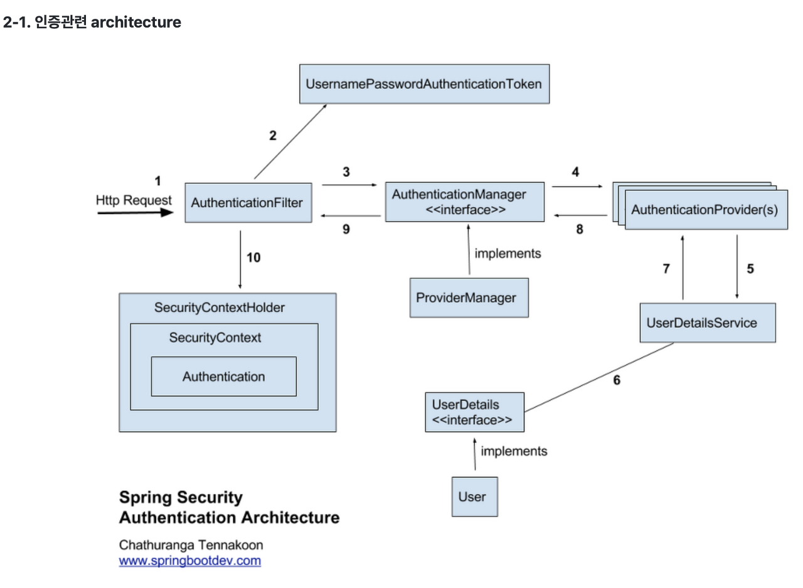

# Spring Security

<br>

## 개념 - 용어 정리

<br>

## **Architecture**

  

<br>

## Spring Security Configuration

0. 라이브러리 추가 (dependencies)

1. web.xml 설정

레거시 프로젝트는 web.xml에 스프링 빈 등록을 위한 설정정보를 작성해야한다. (Spring Security 관련 bean 설정정보 파일)

  <br>

  ``` xml
  <- web.xml - (1) ->
  <context-param>
    <param-name>contextConfigLocation</param-name>
    <param-value>
      /WEB-INF/spring/root-context.xml
      /WEB-INF/spring/security-context.xml
    </param-value>
  </context-param>
  
  <- web.xml - (2) ->
  <context-param>
    <param-name>contextConfigLocation</param-name>
    <param-value>
      com.security.session.config.AppConfig
			com.security.session.config.WebSecurityConfig
    </param-value>
  </context-param>

  ...

  <filter>
		<filter-name>springSecurityFilterChain</filter-name>
		<filter-class>org.springframework.web.filter.DelegatingFilterProxy</filter-class>
	</filter>
	<filter-mapping>
		<filter-name>springSecurityFilterChain</filter-name>
		<url-pattern>/*</url-pattern>
	</filter-mapping>

  ```
  *-* 위처럼 param-value 태그 안에 security 설정정보(security-context)를 넣지 않으면 security-context.xml에서 root-context.xml에 있는 bean 정보를 읽지 못한다. <br>
  *-* AnnotationConfigApplicationContext를 활용해서 Java Configuration을 할 때도 security 설정 클래스를 param-value에 함께 넣어준다. <br>
  *-* DelegatingFilterProxy 등록 <br>
      (스프링 부트와 달리 기존 스프링 프레임워크에서 DelegatingFilterProxy를 등록하지 않으면 spring security 기능을 적용할 수 없다.)

  <br>

  ``` xml
  <- 예) 잘못된 설정 ->
  <context-param>
    <param-name>contextConfigLocation</param-name>
    <param-value>/WEB-INF/spring/root-context.xml</param-value>
    <param-value>/WEB-INF/spring/security-context.xml</param-value>
  </context-param>

  ```


<br>

## AuthenticationManager
  * 구현체 <br>
  *-* ProviderManager

<br><br>

## AuthenticationProvider
---
<br>
회원 로그인 작업 관리 - 아이디 조회 및 비밀번호 매칭 
> UserDetailsService, PasswordEncoder


<br>
  
### UserDetailsService : DB에서 회원정보를 가져와 저장

<br>

### PasswordEncoder : 비밀번호 단방향 암호화 지원
  
  * PasswordEncoder의 구현체 및 암호화 알고리즘 <br>
    *-* BcryptPasswordEncoder : bcrypt <br>
    *-* Argon2PasswordEncoder :  <br>
    *-* Pbkdf2PasswordEncoder : pbkdf2 <br>
    *-* SCryptPasswordEncoder : scrypt <br>

  * SHA-256 vs Bcrypt

<br>

  * 주요 메소드 <br>
    *-* encode(CharSequence rawPassword) : <br>
    *-* matches(CharSequence rawPassword, String encodedPassword) : <br>

<br>


## session management
  - HttpSessionEventPublisher vs HttpSessionListener

  
<br>


## JSTL
> JSP 정규표현식 (JavaServer Pages Standard Tag Library)

<br>

> JavaScript에서 인가된 사용자 정보 사용하기
* authentication, authorize 에서 'var'속성을 이용
``` jsp
<sec:authentication property="principal.userId" var="userId"/>
<sec:authorize access="hasRole('MASTER')" var="isMaster"></sec:authorize>

<script type="text/javascript">
  var userId = ${userId};

  if(${isMaster}) {
    console.log('this is an user having master authority');
  }


</script>

```


Q: check > https://velog.io/@devsh/%EC%8A%A4%ED%94%84%EB%A7%81-%EC%8B%9C%ED%81%90%EB%A6%AC%ED%8B%B0-%EC%84%B8%EC%85%98-Session-Management-%EC%BB%A4%EC%8A%A4%ED%84%B0%EB%A7%88%EC%9D%B4%EC%A7%95-%EA%B0%9C%EB%85%90-%EC%9D%B5%ED%9E%88%EA%B8%B0 <br>
https://docs.spring.io/spring-session/docs/2.2.x/reference/html/spring-security.html <br>

<br>

Q 중복 로그인 방지 ? - https://medium.com/@leejungmin03/spring-%EC%A4%91%EB%B3%B5%EB%A1%9C%EA%B7%B8%EC%9D%B8-%EB%B0%A9%EC%A7%80-9ef32f7e7110 <br>
<br>

중복 로그인 방지 ? 2 - https://kangwoojin.github.io/programing/spring-security-basic-session-management-filter/ <br>
중복 로그인 방지 ? 3 - https://lts0606.tistory.com/320 <br>

스프링 시큐리티 로그인 시리즈 - https://codevang.tistory.com/266 <br>

* Spring boot 버전2 부터는 JDK 11 이상 사용을 권장


<br>

#### [참고]

  * **Spring.io** 
  *-* security guid step-1 in-memory [document] - https://spring.io/guides/gs/securing-web/ <br>
  *-* security guid step-2 architecture [document] - https://spring.io/guides/topicals/spring-security-architecture/ <br>

  *-* DelegatingFilterProxy  - https://velog.io/@yaho1024/spring-security-delegatingFilterProxy <br>
  *-* NoSuchBeanDefinitionException: No bean named 'springSecurityFilterChain' is defined 오류 해결 - https://haenny.tistory.com/224 <br>


  *-* Spring Security 구조 (로그인 과정) - https://jeong-pro.tistory.com/205 <br>
  *-* 로그인 실패시 응답코드 - https://blog.naver.com/genycho/222446074415 <br>

  * with SpringBoot<br>
  *-* 
  
  * with legacy Spring<br>
  *-* **스프링 시큐리티 프로젝트 설정** - https://sjh836.tistory.com/165<br>
  *-* 스프링 시큐리티 프로젝트 설정 - https://bin-repository.tistory.com/128   (springboot에 가까운 느낌) <br>
  *-* **AuthenticationProvider** 개념 - https://gregor77.github.io/2021/05/18/spring-security-03/ <br>
  *-* UserDetails 구현 - https://to-dy.tistory.com/86 <br>
  *-* UserDetails 구현2 - https://vividswan.github.io/2020/09/11/Spring-Security-UserDetails-%EA%B5%AC%ED%98%84.html <br>
  *-* PasswordEncoder - https://velog.io/@corgi/Spring-Security-PasswordEncoder%EB%9E%80-4kkyw8gi<br>
  *-* PasswordEncoder official [**Spring.io**] - https://docs.spring.io/spring-security/reference/features/authentication/password-storage.html#authentication-password-storage <br>
  *-* BCrypt 설명 (Password hashing 시 Bcrypt가 추천되는 이유 ) - https://velog.io/@kylexid/%EC%99%9C-bcrypt-%EC%95%94%ED%98%B8%ED%99%94-%EB%B0%A9%EC%8B%9D%EC%9D%B4-%EC%B6%94%EC%B2%9C%EB%90%98%EC%96%B4%EC%A7%88%EA%B9%8C <br>

  *-* Flash Attribute and AuthenticationFailureHandler [stackOverflow] - https://stackoverflow.com/questions/23844546/flash-attribute-in-custom-authenticationfailurehandler/50429613 <br>

  *-* logout success handler - https://tyson.tistory.com/126<br>
  *-* **session 종료관련 리스너** - https://stackoverflow.com/questions/11843010/logout-session-timeout-catching-with-spring-security<br>
  *-* 중복 로그인 방지(with security vs without security) - http://dveamer.github.io/backend/PreventDuplicatedLogin.html<br>
  *-* session timeout 설정방법 및 우선순위 - https://dololak.tistory.com/706<br>
  *-* 세션 저장소를 이용하는 3가지 방법 - https://parkadd.tistory.com/16 <br>

  *-* JSP에서 spring security 활용 - https://niees.tistory.com/19 <br>

  *-* CSRF token not found error solutions - https://stackoverflow.com/questions/28138864/expected-csrf-token-not-found-has-your-session-expired-403 <br>

  * JSTL <br>
  *-* 인증된 사용자 정보 읽기 - https://taetae0079.tistory.com/6 <br>
  *-* 시큐리티 JS에서 활용하기 - https://stackoverflow.com/questions/30775001/springsecurity-role-check-inside-javascript <br>

  * JWT
  *-* Spring session & JWT [Web 기본] - https://brunch.co.kr/@springboot/491 <br>
  *-* spring security & jwt login - https://velog.io/@shinmj1207/Spring-Spring-Security-JWT-%EB%A1%9C%EA%B7%B8%EC%9D%B8 <br>
  


