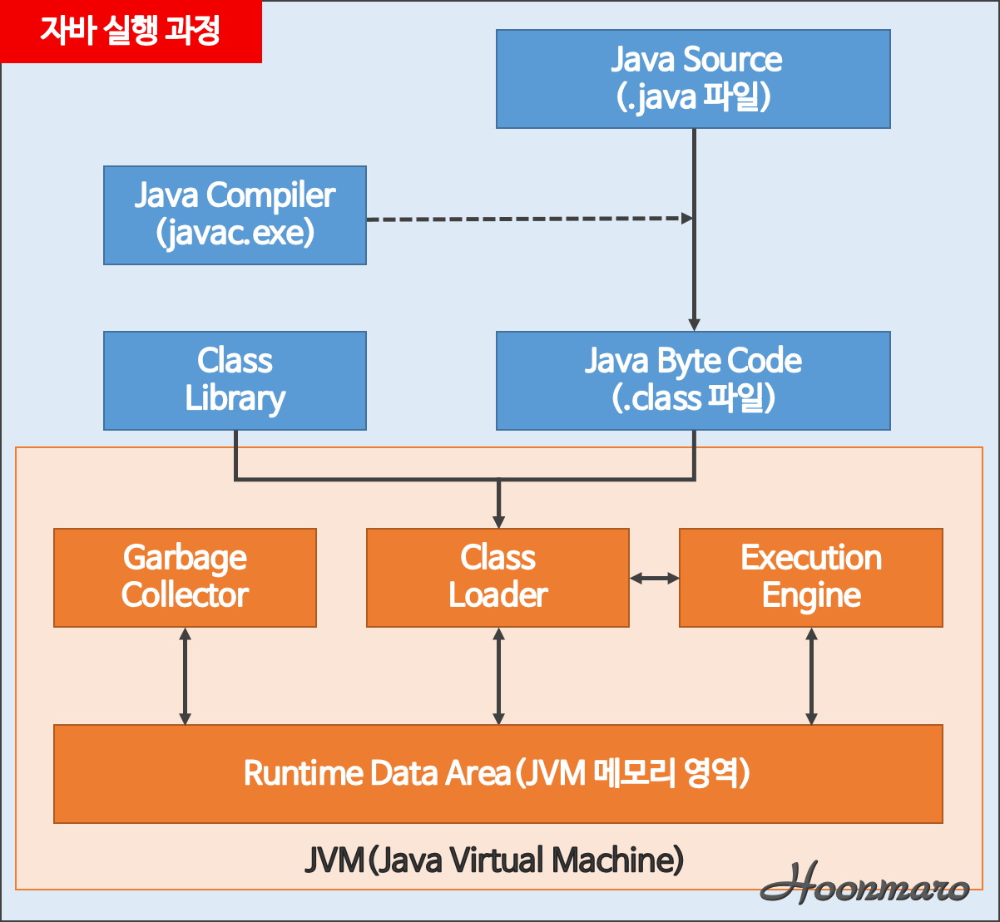

# JVM(Java Virtual Machine)

* Java 실행 과정
  
  

 

* Runtime Data Area (JVM 메모리 영역)

 

### [참고] 
  *-* JVM 메모리영역 구조 - https://hoonmaro.tistory.com/19  
  *-* 가비지 컬렉션 종류 - https://llnote.tistory.com/709  
  *-* 가비지 컬렉터 설명 - https://12bme.tistory.com/57  
  *-* **Garbage Collection 튜닝** (관련 글 참고) - https://d2.naver.com/helloworld/37111  

  *-* 자바 애플리케이션 성능 튜닝의 도(道) (2012) - https://d2.naver.com/helloworld/184615  
  *-* GC 로그 ~ Allocation Failure - https://okky.kr/article/667581  